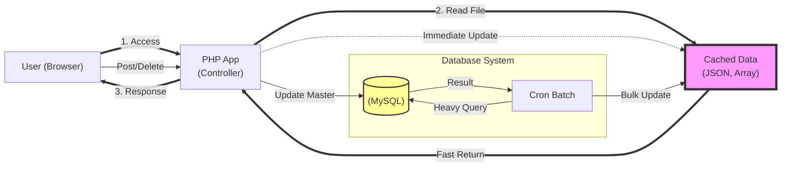
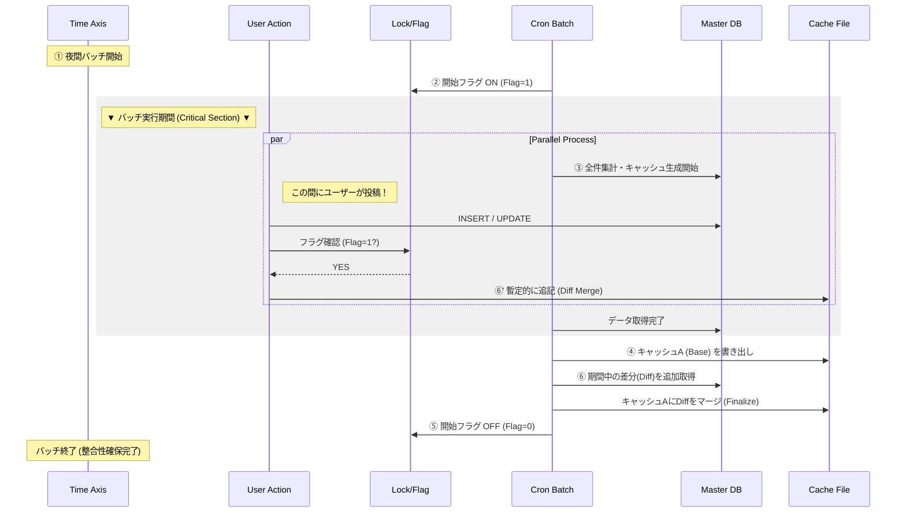

# Portfolio: High-Performance UGC Platform

## ■ プロジェクト概要
個人開発として運用中のユーザー投稿型プラットフォーム。
レンタルサーバー（Mixhost）の制約下で、月間130万PV・同時接続数スパイクに対応するパフォーマンスチューニングを実施。

*   **月間PV:** 1,200,000 PV
*   **収益:** 月約 20万円
*   **インフラ:** Mixhost (Shared Hosting)
*   **技術スタック:** PHP (Laravel), MySQL, Cron, Linux

**■ＰＶ数**  
  
**■収益**  
  

---

## ■ 技術的ハイライト：レンタルサーバーでの限界突破

### 1. 課題：キャッシュ・スタンピードによるサーバー停止危機
サービス急拡大時、動的生成（Laravel）とDB負荷が限界を超え、ホスティング会社より**アカウント停止警告**を受領。

**▼ 当時の警告メール（証拠）**

> 文言: 「サーバー全体への影響が懸念された」→他ユーザに実害が出ている  
> 文言: 「パフォーマンスの制限をかけた」→制限をかけたという事後報告で実質的なペナルティ  
> 数値: Query_time: 10.048353 →1クエリに10秒かかっている絶望感  
> 数値: Rows_examined: 670470 →大量データの取得  
> SQL文: select max(Opponent_User_ID)... →集計が重い原因だと一目で分かる  

### 2. 解決策：Read/Writeの完全分離アーキテクチャ
安易なクラウド移行（課金によるスケールアップ）はROI（投資対効果）が低いと判断し、コードと設計による解決を選択。  
従来の「ユーザーアクセスをトリガーとするキャッシュ生成」を廃止し、<strong>「Cronによる完全非同期・先行生成」</strong>へ刷新することで、参照系のDB負荷を極限まで減少。  

**■システム構成図**  

### 3. 課題と対策：データの整合性担保
上記の構成により負荷は解消したが、バッチ実行中（数分間）のデータ更新による<strong>先祖返り（ロストアップデート）</strong>のリスクが発生。  
これ防ぐため、以下の**差分マージフロー**を実装し、データの整合性を担保。  

■ 整合性担保のロジック

フラグ管理: バッチ開始時にフラグを立て、**現在、キャッシュ生成中である**ことをシステム全体に通知。  
楽観的更新: フラグが立っている間のユーザー投稿は、DBへの保存とは別に、古いキャッシュファイルに対しても暫定的な追記（Diff Merge）を行い、表示上の即時反映を維持。  
事後マージ (追っかけ更新): Cronは「ベースとなるキャッシュ」を作り終えた後、「バッチ開始時刻 〜 現在」の間に更新されたレコードを再度DBから取得（Diff）。最後にこれをベースキャッシュにマージすることで、データ欠損を防止。  

**▼ 整合性フロー図**

