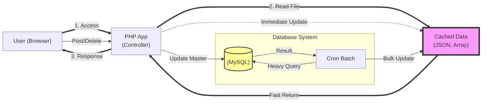
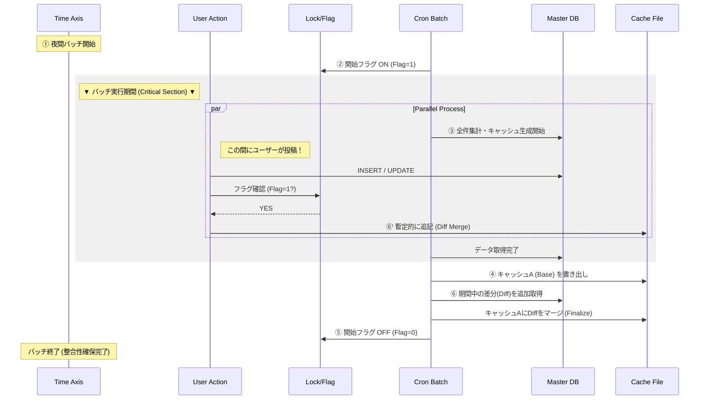

職務経歴書（実績・自己PR書）
氏名： minoru
年齢： 41歳
現職： SIer 開発課長（５年）を経てスペシャリストとしてテックリード

■ 転職の背景： 「部分最適」から「全体最適」へ
現職では、特命案件や他部署の炎上案件救済など、組織の壁を超えた「全体最適」のための動きを経営層より任される機会が増えました。
しかし、既存の組織構造上、評価制度が部署ごとの「自部署のKPI（部分最適）」に留まっており、私が会社全体の利益を最大化する動きをすればするほど、自部署のKPIに貢献できないというギャップを感じるようになりました。
「事業全体の成長」を全員が追う自社サービス企業や、エンジニアがビジネスの境界を超えて動くことが歓迎される環境で、自分の「越境する力」をフルに発揮したいと考え、転職を決意しました。

■ プロフェッショナル・サマリー
技術と組織の境界を「越境」し、ボトルネックを解消する舗装のスペシャリスト

5年間のSIer課長職で培った「組織を動かす視点」と、120万PVの自社サービスを独力で運用する「執念のエンジニアリング」を併せ持つ実践者です。
私が最も価値を発揮するのは、プロジェクトの不確実性が高い局面において、真のボトルネックを特定し、最短距離で解決の道を「舗装」する場面です。

「会議室の議論」で時間を浪費せず、クイックな「動くモックアップ」で合意形成を加速させ、エンジニアが迷わず実装に没頭できるスタブや基盤を先行して構築します。
未経験の言語であっても原理原則から急所を見抜き、泥臭く手を動かして現状を打破する。その「越境する力」を、自社サービスの成長とチームの生産性最大化のために捧げたいと考えています。

■ 4つの強み（Core Value）

1. 120万PVを月額千円で捌く「富豪的プログラミングの否定」と「非同期アーキテクチャ」
当初、教科書通りの「有効期限付きキャッシュ」を実装しましたが、期限切れの瞬間にアクセスが殺到（キャッシュ・スタンピード）し、レンタルサーバーから「アカウント停止警告」を受けるほどの高負荷を発生させてしまいました。
この失敗から、「高負荷下では『ユーザーリクエストをトリガーにDBを叩く』こと自体がリスクである」と判断しました。
ユーザーアクセスとは完全に切り離した**「cronによる先行生成（永続キャッシュ）」と、更新時のみキャッシュを書き換える「イベント駆動の差分更新」**を組み合わせることで、いつアクセスが集中してもサーバー負荷を極限まで下げる構成を確立しました。

2. ユーザーを動かす「泥臭い仕掛け」と「徹底した使い勝手」
綺麗なサイトを作ることよりも、「ユーザーがどうしても使いたくなる状態」を作ることに執着しています。
サービス初期は、掲示板やブログ運営者へメールを送る地道な活動で集客し、「3件書き込まないと閲覧不可」という制限を設けることで、閲覧者が強制的にコンテンツ生産者になるサイクルを生み出しました。
また、ユーザーIDの手入力を廃止し、「URLをコピペするだけでID自動抽出して検索する」機能を実装するなど、自分がヘビーユーザーとして感じる「面倒くささ」を徹底的に排除し、利用者を定着させています。

3. 技術でチームを支える「プレイング・サーバント」
SIer特有の「前工程の完了待ちで手が止まる」現象を、マネジメントと技術の両面から解決します。
「Aさんの処理待ちで進めません」という報告に対し、ただ工程調整をするのではなく、テックリードとして**「接続部分のモック（スタブ）」や「仮のデータ構造」を先行実装して提供**します。
メンバーが直面する技術的・工程的なブロッカーを私が先に「舗装」することで、チーム全員が実装に集中できる環境を構築。ペアプログラミングで若手の自走を支援し、チーム全体のスキルの底上げに貢献します。
私が意識しているのは、『規律を守れ』と強いるのではなく、『規律に乗っかるのが一番楽だ』と思わせる舗装です。
例えば、インターフェースのスタブを先行提供することで、メンバーは悩むことなく正しい実装へと自然と誘導されます。
技術による『お膳立て』こそが、現場の規律を維持する現実的なやり方だと考えています。

4. 事実（ファクト）に基づくリスクマネジメントと進言の勇気
プロジェクトが「沈みゆく泥舟」の状態にある時、多くの現場は事なかれ主義や正常性バイアスに陥ります。
私は支援という立場であっても、現場の違和感を見て見ぬふりをすることはしません。
杞憂に終わるならそれで良しとして「肌感覚」でも懸念を伝え、WBSや数値という「客観的なデータ」に変換し、たとえ上位層にとって耳が痛いことであっても、プロジェクトを救うために必要なエスカレーションを完遂します。
これは「正論による論破」を目的とするものではありません。
日頃から上長やメンバーとは対話を重視し、時には自身の意見を柔軟に修正しながらも、お互いが「今、何が起きているか」という事実を共有できる信頼関係の構築を最優先しています。

■ 代表的なプロジェクト（選抜）

① 【現職・SIer】大規模WF案件のリソース不足の可視化と崩壊の阻止（幽霊担当者入りWBS）
～ 開発担当の枠を超え、嫌われ役を買って出て「物理的破綻」を証明 ～

役割： 開発担当（実態として、プロジェクトの不整合を正すため『嫌われ役』を遂行）
「越境」したアクション：
本来の役割は開発工程の完遂のための支援だったが、現場のWBSの不整合を感じ取りながら開発工程を行うことは「沈みゆく船で椅子を並べ替える行為」に等しいと判断し、プロジェクト全体の不整合を可視化する役割にシフト。

背景:
開始半年が経過した小売店の売上の可視化案件。ドキュメント品質の低さと手戻りの多発により疲弊している現場の支援。次月のコーディングフェーズに向け、明らかに人員が不足していることを肌感覚で察知していたが、現場リーダー層は思考停止に陥っていた。
行動と成果:
「肌感覚」を「物理的な数字」へ変換：WBS作成を自ら引き受け、全タスクを精査。現リソースでは到底埋まらないことを証明するため、あえて「要員Aさん～Eさん（存在しない幽霊担当者）」をアサインしなければ成立しない計画図を作成。
人員不足を言葉で訴えても「精神論」や「現場の努力不足」で返されるリスクがあったため、物理的に正しいWBSで不足を「見える化」し、上層部の議論を「どう人を確保するか」という具体策へ強制的にシフトさせた。
このアクションは、単なる独断専行ではなく、PLとの幾度とないインプットや、上長への事前相談・許可といった「組織としての順序」を踏んだ上で行っている。
プロジェクトメンバーとはランチを共にするような信頼関係があるからこそ、この「幽霊WBS」が単なる批判ではなく、プロジェクトを救うための「共通の事実認識」として機能しました。

ビジネス貢献:
「手遅れ」になる前の軌道修正: フェーズ移行直前という「まだ打ち手が間に合うタイミング」で上位層に現実を直視させ、人員補充や納期調整の議論を強制的に開始させた。
未然の炎上回避: プロジェクトの「死」を予見し、物理的根拠をもってエスカレーションすることで、納期直前のパニックや現場の離脱という最悪のシナリオを回避。
上流の品質定義: 「コードを書く前の段階で、プロジェクトが失敗する可能性を物理的に除去する」という、実装以前のレイヤーにおける品質管理を完遂した。
事前の合意形成: 現場の声を無視して一人で突き進むのではなく、**PLやメンバーが抱えていた『言い出せない不安』を数字という共通言語に翻訳。**上位層へのエスカレーションも、現場の総意として合意形成を行った上でのアクションとなった。

このアクションは、自部署のKPIには一切貢献できておらず、社内評価としてはプラスになりませんでした。しかし、エンジニアとして『物理的に破綻している計画』を黙認することはできず、プロジェクトの成功という『全体最適』を優先しました。

② 【個人開発】高効率アーキテクチャによる事業利益率の最大化（営業利益率99%超の維持）
～ ユーザー投稿型プラットフォームへの二度のサーバー停止警告を「仕様の簡略化」と「非同期化」で乗り越えた、執念のエンジニアリング ～

役割: 企画、開発、運用（すべて1人）
環境: PHP (Laravel), MySQL (Shared Hosting), Linux, Cron
実績: 月間120万PVを月額1,000円のインフラで維持。3年間メンテナンスフリーで稼働中。

【課題：成長の裏で繰り返された「サーバー停止警告」】
サービス拡大に伴い、共有ホスティング（Mixhost）の制約下で二度の深刻な負荷危機に直面しました。
この際、安易なクラウド移行（スペックアップ）で解決を急がず、「対症療法（金で時間を買う）」と「根治（コードの最適化）」を戦略的に使い分けることで、極限の利益率を実現しました。

【闘争のプロセス：3段階のアーキテクチャ進化】
単なる技術選定ではなく、ビジネス（UX/PV）とインフラ負荷の天秤をかけながら、以下のステップで最適解を削り出しました。

Step 1：緊急回避（暫定的な全件表示への仕様変更）
判断: Laravelの標準ページネーション機能が内部で自動発行する集計クエリ（COUNT(*)）が、50万件超のデータにおいては致命的なDB負荷（スロークエリ）の主因となっていたため、標準機能の利用を一時的に廃止。
対応: フレームワークのブラックボックスな挙動を避け、DB負荷の低いシンプルな「全件表示」に切り替え、サーバーの即時停止を回避。
結果と葛藤: 負荷は下がったが、データ過多でUXが崩壊し、ページ遷移がなくなることでPV（収益）も減少。エンジニアとして**「サービスを守るが、ビジネスを殺している」状況に強い危機感を抱く。**

Step 2：第2の警告と「キャッシュ・スタンピード」の失敗
改善試行: ページネーションを復活させるため、ユーザーアクセスをトリガーにDB結果をキャッシュ化。
新たな問題: キャッシュ切れの瞬間に大量のリクエストがDBへ殺到。スロークエリが多発し、二度目の停止警告を受ける。
教訓: 「ユーザーのリクエストを起点にDBを叩く」というWeb開発の常識自体が、この規模と環境ではリスクであること。

Step 3：最終解：集計済みデータオブジェクトによるリードモデルの構築
解決策: ユーザーのリクエスト時にDBで集計を行うのをやめ、集計済みデータオブジェクトのキャッシュから取得するようデータソースの完全切り替えを実施。
技術的工夫: 夜間バッチ（Cron）でユーザーIDごとの口コミ件数や内容を事前に集計し、「口コミデータオブジェクト（JSON/配列等）」として永続キャッシュ化。
挙動: ユーザーアクセス時は、ユーザーIDをキーにキャッシュから直接オブジェクトを取得・展開するのみ。DBへの検索・集計クエリを完全に排除することで、DB負荷をゼロ化しつつ、物理的な限界に近いレスポンス速度を実現。
整合性の担保: 更新時は「イベント駆動による差分マージ」を行い、バッチ実行を待たずに最新の状態がキャッシュに反映される仕組みを構築。

【技術的意義とビジネス貢献】
FinOpsの体現: 100万PV超の規模であれば、通常は数万円〜のクラウドコストがかかる所を、アーキテクチャの工夫により月1,000円に抑制。
技術的負債への誠実さ: 「スペックを上げれば解決する」という風潮に対し、まず根本原因（非効率なクエリや設計）を徹底的に潰すことで、持続可能な利益構造を構築。
運用コスト（人件費）のゼロ化: 徹底した自動化と負荷対策により、3年間トラブルなしの「放置できるシステム」へと昇華。

③ 【現職・SIer】役員直轄・社内ツールの爆速開発
～ 「ペライチ60分・実装3日」で変革し、全社文化として定着 ～

役割: リードエンジニア
環境: Slack API, GCP (Cloud Run), Python
背景: 本部長より「組織の風通しを良くする仕組み」を求められた。通常なら要件定義に1ヶ月はかかる案件。
行動と成果:
超高速の合意形成:
重厚な仕様書は作成せず、パワポ1枚のイメージ図を60分で作成。「方向性はこれで合ってますか？」と本部長と5分ですり合わせ、その場でイメージを共有・合意。

実利と使い勝手重視の技術選定:
ゼロからのWebアプリ開発は、開発工数がかかる上に「ブラウザを開く」という手間がユーザーの利用率を下げると判断し却下。「通知基盤」も「認証」も揃っているSlackに乗っかることで、開発を3日に短縮すると同時に、**「日常業務の動線内で完結する最高の使い勝手」を実現した。
「作る責任」と「回る仕組み」の確立:
MVPは私が独力で開発したが、全社展開を見据え Cloud LoggingとCloud Monitoringによるエラー監視・自動通知フローを構築。
万が一の障害時には即座に管理者へ通知が飛ぶ仕組みを整えたが、リリースから現在に至るまで**「クリティカルアラート発報ゼロ」**を継続中。

サーバーレス（Cloud Run）による運用の最小化:
インフラ管理のオーバーヘッドを無くすため、コンテナベースのサーバーレス環境を採用。GitHubへのプッシュをトリガーに Cloud Build で自動デプロイされる CI/CD パイプラインを構築し、開発からリリースまでのリードタイムを極限まで短縮。
「作る責任」を支える自動化:
単なるモック作成で終わらせず、Cloud Logging と Cloud Monitoring による監視設定までを自動化。少人数（自分一人）で品質を担保し続けるためのモダンな運用プラクティスを、SIerの現場に持ち込んだ。

ビジネス貢献:
現在は私の手を離れ、メンテナンスフリーで稼働中。本部会議にて、本部長より定期的に「投稿数・活用数」が発表されるなど、組織の風通しを可視化する指標として定着。単なるツール導入に留まらず、会社の風土改革の一端を担っている。

④ 【現職・SIer】炎上案件レスキューと品質・セキュリティの立て直し
～ 未知の言語でも即座に「穴」を見抜き、システム全域を堅牢化 ～

役割: テックリード（支援として途中参画）
環境: ASP.NET（※参画時は未経験）
課題:
物流システムの構築案件。仕様追加とバグ対応に追われ、コード品質が担保されていない状態だった。
行動と成果:
言語の壁を超えたコード監査（脆弱性発見）:
ASP.NETは未経験だったが、フロントエンドのソースコードの変数出力処理を見て**「サニタイジングが漏れている気がする」**と直感。即座に検証コード（スクリプト埋め込み）を実行し、XSS（クロスサイトスクリプティング）の脆弱性があることを発見。
水平展開:
単なる「1箇所のバグ修正」で終わらせず、同様の実装パターンがシステム全体に散見されると予測。自ら全画面全ソースの調査を行い、影響箇所を特定し、システム全体のセキュリティホールを一網打尽に修正。
成果:
リリース後に発覚していれば大事故になる脆弱性を事前に解除。途中参画、未経験の言語環境であっても、「Webアプリケーションの原理原則」に基づき、品質とセキュリティを担保できることを証明。

⑤ 【現職・SIer】自社製ERPパッケージ旅費精算システム刷新
～ 自社製ERPパッケージ初のSaaS連携と、泥臭いデータ解析による業務の劇的効率化 ～

役割: 開発担当 / リードエンジニア
環境: The Amoeba（京セラのアメーバ経営をさせるERPパッケージ）, Java・JSP, DB2 , 関連API: ジョルダンAPI

背景/課題:
長年手入力に依存していた旅費精算システムは従業員の負担が大きく、入力ミスも散見されていた。
特に交通手段の発着駅と料金の計算は担当者の手入力に依存していた。
旅費精算システムを刷新する際、The Amoebaで前例がなかった外部SaaSサービスとAPI連携を行い、入力ミスを極限まで減らすための技術的チャレンジが求められていた。

行動と成果:

The Amoeba初のSaaS連携を実現し、ERPの可能性を拡張:
特定のERPパッケージとSaaSサービス（ジョルダンAPI）のAPI連携を社内で初めて実行。これにより、既存システムの枠を超えた機能拡張の道を切り開き、社内における技術的な「越境」を推進した。

ICカード固有のデータ仕様を解析し、正規APIとの連携ロジックを独自開発:
交通系ICカード内に記録されている**バイナリデータ（サイバネコード等）**から利用駅や料金を特定するロジックの実装を担当。
一般的な仕様書が存在しない領域であったため、既存の技術資料やコミュニティの知見を徹底的にリサーチし、データ構造を解析・プログラム化。
これによりICカードから抽出したコードを、ジョルダンAPIが解釈可能な形式へ変換するミドルウェア的な機能を構築し、正確な駅名取得を実現した。

ユーザー負担を極限まで減らすGUI設計・実装:
ジョルダンAPIにて取得した発着駅の一連の情報を旅費精算の起票画面に分かりやすく一覧表示。新幹線などICカード利用外の交通手段についても、ジョルダンAPIからの自動入力機能や、ICカード情報との組み合わせ選択が可能な直感的でミスのないGUIを設計・実装。従業員が迷わず、効率的に入力できる仕組みを提供した。
ビジネス貢献:
今まで手入力しかできなかった旅費精算業務の入力負担を劇的に削減。従業員の生産性向上とヒューマンエラーの抑制に大きく貢献し、全社的な業務効率化、ひいては「全体最適」に寄与した。このプロジェクトは、単なるツールの導入に留まらず、社内ERPのSaaS連携という新たな技術的挑戦を通じて、今後のシステム拡張における規範を築いた。

■ 技術スタック（適材適所の選定）

Modern / Cloud Native:
GCP (Cloud Run, Cloud Build, GCE), Docker, GitHub Actions / Cloud Build (CI/CD)
※SIerの現場においても、スピードと信頼性を両立させるため、自らCI/CDパイプラインの構築やコンテナ化を主導。

High Performance / Business Logic:
PHP (Laravel - 高負荷対策・内部SQL最適化), Python (Slack API連携・業務自動化), Java/C# (堅牢な業務基盤)

DevOps / Tooling:
Slack API, Monitoring (Cloud Logging / Monitoring), Linux (Shell scripting)

■ エンジニアとしてのスタンス

ビジネスへの向き合い方：「議論より、動くモックアップを」
私は、「最新技術を使うこと」や「綺麗なドキュメントを書くこと」それ自体を目的にしません。私の価値は、ビジネスのフェーズに合わせて最適な「解」を出すことです。
0→1（検証）フェーズ：
会議室で10時間議論する暇があれば、その時間でコードを書き、動くものを見せて合意を取ります。ここではドキュメントよりもスピードと「動く事実」を最優先します。
1→10（運用・拡大）フェーズ：
ビジネス価値が証明された後は、SIerで培った経験を活かし、保守性・可読性を考慮したドキュメント化と、標準規約に則ったリファクタリングを徹底します。「作って終わり」ではなく「長く稼働し続ける資産」に昇華させます。

技術への向き合い方：「根治（最適化）」を優先するエンジニアリング
クラウド全盛の現代において、リソース不足を「札束（スペックアップ）」で解決することは容易です。しかし、私は安易なスペックアップの前に「アプリケーションレベルで解決できることはないか？」を徹底的に問うスタイルを貫いています。
一時的な回避策としてのスペックアップ： 大いに賛成です。ビジネスの機会損失を防ぐためにまず「時間を買う」判断も必要です。
根本解決としての最適化： スペックアップと並行して、必ずボトルネックの正体（非効率なクエリ、設計ミス）を突き止め、改修し、一時的に上げたスペックを下げられないかを判断します。
この「対症療法」と「根治」を戦略的に使い分けることで、システムの信頼性とビジネスの利益率を両立させるのが私のエンジニアとしての誠実さです。

技術への適応力：「言語」の壁を超えて問題を解決する
炎上案件の支援（火消し）では、Java, C#, Nuxt.js など、プロジェクトごとに技術スタックが固定されており、未経験の言語環境に飛び込むことも日常茶飯事です。
しかし、私は言語の文法暗記に頼らず、PHPのチューニングで培った**「プログラミングの基礎原理（メモリ、通信、アルゴリズム）」**でコードを読み解くため、どのような言語でもロジックを把握し、改修を行うことができています。
既存案件（火消し）: 未知の言語でもソースコードから仕様を逆算し、ボトルネックを特定・修正。
新規案件（特命）: Python (Slack API) など、開発スピードとライブラリの充実度を考慮し、要件に最適な技術をゼロベースで選定。
「使える言語」に縛られず、「解決すべき課題」に合わせて即座に手札を増やすスタイルです。

組織への向き合い方：「誠実な客観性」という武器
私はプロジェクトに対して常に『誠実』でありたいと考えています。
支援として参画した際、現場のリーダーが疲弊し、危機感を感じつつも上層部へのエスカレーションができない状況を目の当たりにしました。私は**『支援者という客観的な立場』を戦略的に活用**し、現場の忖度や疲弊に飲み込まれることなく、あえて空気を読まない『幽霊担当者入りのWBS』を提示しました。
これは、単なる独断専行ではなく、疲弊した現場に代わって事実を突きつけることが、プロジェクトとメンバーを救う唯一の手段だと判断したからです。この『越境する力』こそが、私の考えるテックリードの責務です。
しかしながら、私の突破力は、周囲の協力があって初めて成立するものです。だからこそ、周囲への適切な相談と、透明性の高いエスカレーションを、技術スキルと同じくらい大切にしています。
最終的な意思決定に従う柔軟性と、目的達成のために粘り強く対話を続ける姿勢。
この両輪で、不確実性の高いプロジェクトを確実に完遂させます。

# Portfolio: High-Performance UGC Platform

## ■ プロジェクト概要
個人開発として運用中のユーザー投稿型プラットフォーム。
レンタルサーバー（Mixhost）の制約下で、月間120万PV・同時接続数スパイクに対応するパフォーマンスチューニングを実施。

*   **月間PV:** 1,200,000 PV
*   **収益:** 月約 20万円
*   **インフラ:** Mixhost (Shared Hosting)
*   **技術スタック:** PHP (Laravel), MySQL, Cron, Linux

**■ＰＶ数**  
  
**■収益**  
  

---

## ■ 技術的ハイライト：レンタルサーバーでの限界突破

### 1. 課題：キャッシュ・スタンピードによるサーバー停止危機
サービス急拡大時、動的生成（Laravel）とDB負荷が限界を超え、ホスティング会社より**アカウント停止警告**を受領。

**▼ 当時の警告メール（証拠）**

> 文言: 「サーバー全体への影響が懸念された」→他ユーザに実害が出ている  
> 文言: 「パフォーマンスの制限をかけた」→制限をかけたという事後報告で実質的なペナルティ  
> 数値: Query_time: 10.048353 →1クエリに10秒かかっている絶望感  
> 数値: Rows_examined: 670470 →大量データの取得  
> SQL文: select max(Opponent_User_ID)... →ユーザーアクセスをトリガーとするキャッシュ生成処理の一部  

### 2. 解決策：Read/Writeの完全分離アーキテクチャ
安易なクラウド移行（課金によるスケールアップ）はROI（投資対効果）が低いと判断し、コードと設計による解決を選択。  
従来の「ユーザーアクセスをトリガーとするキャッシュ生成」を廃止し、<strong>「バッチによる完全非同期・先行生成」</strong>と<strong>「イベント駆動の差分更新」</strong>へ刷新することで、参照系のDB負荷を極限まで減少。  

**■システム構成図**  

### 3. 課題と対策：データの整合性担保
上記の構成により負荷は解消したが、バッチ実行中（数分間）のデータ更新による<strong>先祖返り（ロストアップデート）</strong>のリスクが発生。  
これ防ぐため、以下の**差分マージフロー**を実装し、データの整合性を担保。  

**▼ 整合性フロー図**

■ 整合性担保のロジック

フラグ管理: バッチ開始時にフラグを立て、**現在、キャッシュ生成中である**ことをシステム全体に通知。  
楽観的更新: フラグが立っている間のユーザー投稿は、DBへの保存とは別に、古いキャッシュファイルに対しても暫定的な追記（Diff Merge）を行い、表示上の即時反映を維持。  
事後マージ (追っかけ更新): Cronは「ベースとなるキャッシュ」を作り終えた後、「バッチ開始時刻 ～ 現在」の間に更新されたレコードを再度DBから取得（Diff）。最後にこれをベースキャッシュにマージすることで、データ欠損を防止。  

