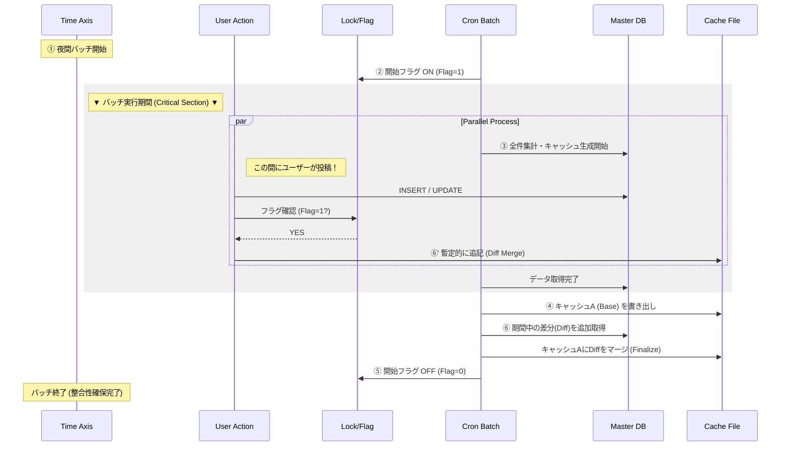

# Portfolio: minoru (Boundary-Crossing Tech Lead)

## 📌 はじめに：私の提供価値
**「技術と組織の境界を『越境』し、最短距離でボトルネックを解消する舗装のスペシャリスト」**

5年間のSIer開発課長職で培った「経営・組織視点」と、120万PVの自社サービスを独力で運用する「執念のエンジニアリング」を併せ持つ実践者です。

不確実性の高い局面において、真のボトルネックを特定し、チームが迷わず実装に没頭できるよう道を「舗装」することに最も価値を発揮します。
---

## 🛠 目次
- [4つの強み (Core Value)](#-4つの強み-core-value)
- [主要プロジェクト実績](#-主要プロジェクト実績)
- [技術スタック](#-技術スタック)
- [エンジニアとしてのスタンス](#-エンジニアとしてのスタンス)


---
## 💪 4つの強み (Core Value)

<details>
<summary><b>1. 120万PVを月額千円で捌く「非同期アーキテクチャ」</b></summary>


### 
- **課題：** 従来のキャッシュ戦略（期限付き）では、アクセス殺到時にサーバーが停止する「キャッシュ・スタンピード」が発生。
- **解決：** ユーザーアクセスをトリガーにDBを叩かない「cronによる先行生成（永続キャッシュ）」と「イベント駆動の差分更新」を組み合わせ。
- **価値：** インフラコストを抑えつつ、物理限界に近いレスポンス速度と可用性を両立。
</details>

<details>
<summary><b>2. ユーザーを動かす「泥臭い仕掛け」と「徹底した使い勝手」</b></summary>


### 
- **執着：** 綺麗なサイトを作ることより、「ユーザーがどうしても使いたくなる状態」を作ることに注力。
- **実績：** 「3件書き込まないと閲覧不可」という制限で閲覧者を生産者に変えるサイクルや、URLコピペだけで情報を自動抽出する検索機能の実装。
- **結果：** 広告宣伝費ゼロで月間120万PVまで成長。
</details>

<details>
<summary><b>3. 技術でチームを支える「プレイング・サーバント」</b></summary>


### 
- **手法：** 前工程の完了を待つのではなく、テックリードとして「接続部分のモック（スタブ）」や「仮データ」を先行実装して提供。
- **哲学：** 「規律を守れ」と強いるのではなく、「規律に乗っかるのが一番楽だ」と思わせる仕組み（舗装）こそが、現場の規律を維持する現実的なやり方。
</details>

<details>
<summary><b>4. 事実（ファクト）に基づくリスクマネジメントと進言の勇気</b></summary>


### 
- **姿勢：** 正常性バイアスに陥った現場の違和感を、WBSや数値という「客観的データ」に変換してエスカレーション。
- **行動：** たとえ上位層にとって耳が痛いことでも、プロジェクトを救うために必要な「事実」を伝える。
</details>

---


## 🚀 主要プロジェクト実績

### ① 【SIer】大規模案件のリソース不足の可視化と崩壊の阻止
**～ 開発担当の枠を超え、嫌われ役を買って出て「物理的破綻」を証明 ～**

- **3行サマリー：**
    - 現場の思考停止を打破するため、自らWBSを作成。
    - 存在しない**「幽霊担当者」をアサインしたWBS**で人員不足を物理的に証明。
    - 上層部の議論を「精神論」から「具体的な人員確保」へ強制的にシフトさせ、炎上を未然に回避。

<details>
<summary>詳細を見る（越境したアクションとビジネス貢献）</summary>


### 
**役割：** 開発担当（実態として、プロジェクトの不整合を正すため『嫌われ役』を遂行）   

**「越境」したアクション：** 本来の役割は開発工程の完遂のための支援だったが、現場のWBSの不整合を感じ取りながら開発工程を行うことは「沈みゆく船で椅子を並べ替える行為」に等しいと判断し、プロジェクト全体の不整合を可視化する役割にシフト。  

**背景:** 開始半年が経過した小売店の売上の可視化案件。ドキュメント品質の低さと手戻りの多発により疲弊している現場の支援。次月のコーディングフェーズに向け、明らかに人員が不足していることを肌感覚で察知していたが、現場リーダー層は思考停止に陥っていた。  

**行動と成果:** 「肌感覚」を「物理的な数字」へ変換：WBS作成を自ら引き受け、全タスクを精査。現リソースでは到底埋まらないことを証明するため、あえて「要員Aさん～Eさん（存在しない幽霊担当者）」をアサインしなければ成立しない計画図を作成。  
人員不足を言葉で訴えても「精神論」や「現場の努力不足」で返されるリスクがあったため、物理的に正しいWBSで不足を「見える化」し、上層部の議論を「どう人を確保するか」という具体策へ強制的にシフトさせた。  
このアクションは、単なる独断専行ではなく、PLとの幾度とないインプットや、上長への事前相談・許可といった「組織としての順序」を踏んだ上で行っている。  
プロジェクトメンバーとはランチを共にするような信頼関係があるからこそ、この「幽霊WBS」が単なる批判ではなく、プロジェクトを救うための「共通の事実認識」として機能しました。  

**ビジネス貢献:** 「手遅れ」になる前の軌道修正: フェーズ移行直前という「まだ打ち手が間に合うタイミング」で上位層に現実を直視させ、人員補充や納期調整の議論を強制的に開始させた。  

**未然の炎上回避:** プロジェクトの「死」を予見し、物理的根拠をもってエスカレーションすることで、納期直前のパニックや現場の離脱という最悪のシナリオを回避。

**上流の品質定義:** 「コードを書く前の段階で、プロジェクトが失敗する可能性を物理的に除去する」という、実装以前のレイヤーにおける品質管理を完遂した。

**事前の合意形成:** 現場の声を無視して一人で突き進むのではなく、**PLやメンバーが抱えていた『言い出せない不安』を数字という共通言語に翻訳。**上位層へのエスカレーションも、現場の総意として合意形成を行った上でのアクションとなった。  

このアクションは、自部署のKPIに貢献できておらず、社内評価としてはプラスになりませんでした。しかし、エンジニアとして『物理的に破綻している計画』を黙認することはできず、プロジェクトの成功という『全体最適』を優先しました。
</details>

---

### ② 【個人開発】120万PV UGCプラットフォームの利益最大化
**～ 二度のサーバー停止警告を「非同期化」で乗り越えた、執念のエンジニアリング ～**

- **3行サマリー：**
    - 月間120万PVを月額1,000円の共有サーバーで運用。
    - 負荷原因（クエリ）の徹底改修により、安易なスペックアップを拒否。
    - 整合性マージフローの実装により、高負荷下でのデータ欠損を防止。

<details>
<summary>詳細を見る（技術的ハイライト：システム構成図あり）</summary>

<br>

**役割:** 企画、開発、運用（すべて1人）
**環境:** PHP (Laravel), MySQL (Shared Hosting), Linux, Cron
**実績:** 月間120万PVを月額1,000円のインフラで維持。3年間メンテナンスフリーで稼働中。

**【課題：成長の裏で繰り返された「サーバー停止警告」】**
サービス拡大に伴い、共有ホスティング（Mixhost）の制約下で二度の深刻な負荷危機に直面しました。
この際、安易なクラウド移行（スペックアップ）で解決を急がず、「対症療法（金で時間を買う）」と「根治（コードの最適化）」を戦略的に使い分けることで、極限の利益率を実現しました。

**【闘争のプロセス：3段階のアーキテクチャ進化】**
単なる技術選定ではなく、ビジネス（UX/PV）とインフラ負荷の天秤をかけながら、以下のステップで最適解を削り出しました。

**Step 1：** 緊急回避（暫定的な全件表示への仕様変更）
**判断:** Laravelの標準ページネーション機能が内部で自動発行する集計クエリ（COUNT(*)）が、50万件超のデータにおいては致命的なDB負荷（スロークエリ）の主因となっていたため、標準機能の利用を一時的に廃止。
**対応:** フレームワークのブラックボックスな挙動を避け、DB負荷の低いシンプルな「全件表示」に切り替え、サーバーの即時停止を回避。
**結果と葛藤:** 負荷は下がったが、データ過多でUXが崩壊し、ページ遷移がなくなることでPV（収益）も減少。エンジニアとして**「サービスを守るが、ビジネスを殺している」状況に強い危機感を抱く。**

**Step 2：** 第2の警告と「キャッシュ・スタンピード」の失敗
**改善試行:** ページネーションを復活させるため、ユーザーアクセスをトリガーにDB結果をキャッシュ化。
**新たな問題:** キャッシュ切れの瞬間に大量のリクエストがDBへ殺到。スロークエリが多発し、二度目の停止警告を受ける。
**教訓:** 「ユーザーのリクエストを起点にDBを叩く」というWeb開発の常識自体が、この規模と環境ではリスクであること。

**Step 3：** 最終解：集計済みデータオブジェクトによるリードモデルの構築
**解決策:** ユーザーのリクエスト時にDBで集計を行うのをやめ、集計済みデータオブジェクトのキャッシュから取得するようデータソースの完全切り替えを実施。
**技術的工夫:** 夜間バッチ（Cron）でユーザーIDごとの口コミ件数や内容を事前に集計し、「口コミデータオブジェクト（JSON/配列等）」として永続キャッシュ化。
**挙動:** ユーザーアクセス時は、ユーザーIDをキーにキャッシュから直接オブジェクトを取得・展開するのみ。DBへの検索・集計クエリを完全に排除することで、DB負荷をゼロ化しつつ、物理的な限界に近いレスポンス速度を実現。
**整合性の担保:** 更新時は「イベント駆動による差分マージ」を行い、バッチ実行を待たずに最新の状態がキャッシュに反映される仕組みを構築。

**【技術的意義とビジネス貢献】**
**FinOpsの体現:** 100万PV超の規模であれば、通常は数万円〜のクラウドコストがかかる所を、アーキテクチャの工夫により月1,000円に抑制。
**技術的負債への誠実さ:** 「スペックを上げれば解決する」という風潮に対し、まず根本原因（非効率なクエリや設計）を徹底的に潰すことで、持続可能な利益構造を構築。
**運用コスト（人件費）のゼロ化:** 徹底した自動化と負荷対策により、3年間トラブルなしの「放置できるシステム」へと昇華。

## ■ プロジェクト概要
個人開発として運用中のユーザー投稿型プラットフォーム。
レンタルサーバー（Mixhost）の制約下で、月間120万PV・同時接続数スパイクに対応するパフォーマンスチューニングを実施。

* **月間PV:** 1,200,000 PV
* **収益:** 月約 20万円
* **インフラ:** Mixhost (Shared Hosting)
* **技術スタック:** PHP (Laravel), MySQL, Cron, Linux

### ■ ＰＶ数・収益実績


---

## ■ 技術的ハイライト：レンタルサーバーでの限界突破

### 1. 課題：キャッシュ・スタンピードによるサーバー停止危機
サービス急拡大時、動的生成（Laravel）とDB負荷が限界を超え、ホスティング会社より**アカウント停止警告**を受領。

**▼ 当時の警告メール（証拠）**


### 2. 解決策：Read/Writeの完全分離アーキテクチャ
安易なクラウド移行はROIが低いと判断し、コードによる解決を選択。**「バッチによる完全非同期・先行生成」**と**「イベント駆動の差分更新」**へ刷新。

**■ システム構成図**

```mermaid
graph LR
    User["User (Browser)"]
    App["PHP App<br>(Controller)"]
    Cache["Cached Data<br>(JSON, Array)"]

    subgraph Storage ["Database System"]
        direction TB
        DB[("(MySQL)")]
        Cron["Cron Batch"]
    end

    User == "1. Access" ==> App
    App == "2. Read File" ==> Cache
    Cache == "Fast Return" ==> App
    App == "3. Response" ==> User

    User -- "Post/Delete" --> App
    App -- "Update Master" --> DB
    App -.-> |"Immediate Update"| Cache

    Cron -- "Heavy Query" --> DB
    DB -- "Result" --> Cron
    Cron -- "Bulk Update" ==> Cache

    style Cache fill:#f9f,stroke:#333,stroke-width:4px
    style DB fill:#ff9,stroke:#333,stroke-width:2px
```


### 3. 課題と対策：データの整合性担保
上記の構成により負荷は解消したが、バッチ実行中（数分間）のデータ更新による<strong>先祖返り（ロストアップデート）</strong>のリスクが発生。  
これ防ぐため、以下の**差分マージフロー**を実装し、データの整合性を担保。  

**▼ 整合性フロー図**




</details>


